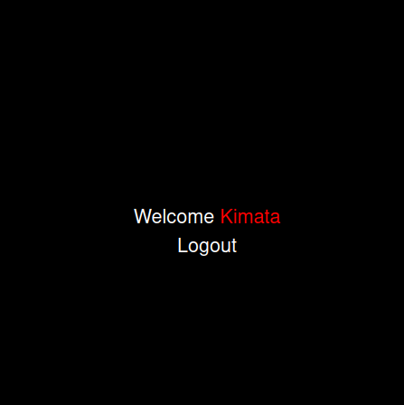

### Login-System
This repo is about a simple login sytem where your are needed to register for you to access the system. After registration your are supposed to use the same details to login.

For you to register successfuly you must meet a couple of conditions, Eg the password should have a min of 8 digits.

### Below are the screeshot of the same:

#### 1.Registration
Currently the profile picture upload is not working due to ...😴 But it is being impleamented.

#### 2.Login
After a successfull registration you will be directed to `Login` page. Here, your required to provide the `username` and the `password` that you used to register.

#### 3.Home Page
After login you will be directed to the `Home` page. Here you will have a welcome notification.

